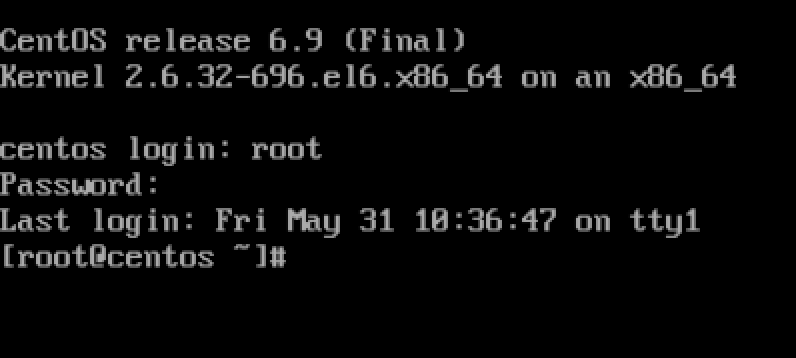
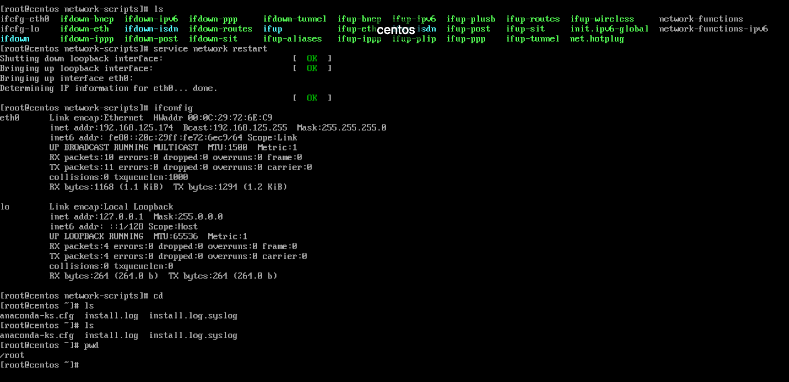
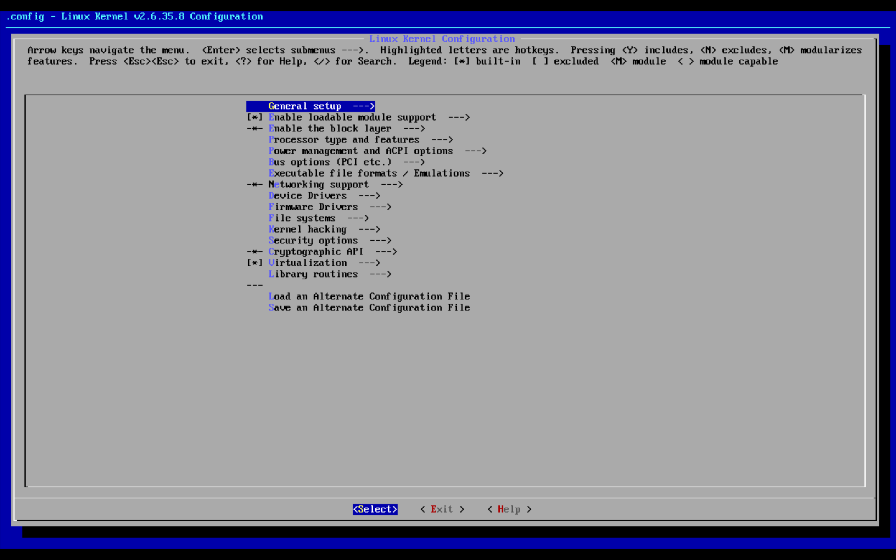

## 安装centos6.9虚拟机

镜像： CentOS-6.9-x86_64-minimal.iso

问题： 正常安装会出现vmware-tools install failed错误无法进入系统，自定义虚拟机安装。



## 虚拟机未和mac处于同一子网内

原因：eth0网卡未设置成boot自启，修改`/etc/sysconfig/network-scripts/ifcfg-eth0`中的onboot改为**yes**

重启网络服务后正常`service network restart` 如下图所示：



## 基本配置

主要需要更新源、安装git、make、gcc、automake、autoconf、libtool等软件包，配置好ssh和vmware-tools方便管理使用虚拟机

1. 修改`/etc/yum.repos.d/CentOS-Base.repo`配置文件，使用命令`makecache`更新源
2. 下载软件包安装`[root@centos ~]# yum install -y zsh git vim gcc automake autoconf libtool make patch && sh -c "$(curl -fsSL https://raw.githubusercontent.com/robbyrussell/oh-my-zsh/master/tools/install.sh)"`
3. 修改配置文件`/etc/ssh/sshd_config`打开22端口的服务，使用命令重启sshd`service sshd restart`
4. 挂载vmware-tools光驱在/mnt/cdrom上，这是一个只读文件系统，把压缩包拷出来再解压，安装好了vmware-tools，方便管理文件。


## 编译内核（打patch）

准备好以下两个个文件来编译内核：

- linux-2.6.35.8.tar.gz
- netfilter-layer7-v2.23.tar.gz

```bash
cd /root
tar xf linux-2.6.35.8.tar.gz -C /usr/src \
    && tar xf netfilter-layer7-v2.23.tar.gz \
    && ln -s /usr/src/linux-2.6.35.8 /usr/src/linux 
cd /usr/src/linux
patch -p1 < /root/netsec/netfilter-layer7-v2.23/kernel-2.6.35-layer7-2.23.patch 
cp /boot/config-2.6.32-696.el6.x86_64 /usr/src/linux/.config
make menuconfig　
```


### 报错：unable to find the ncurses libraries

原因：缺少ncurses-devel，重新安装`yum install ncurses-devel`


### 进入编译内核阶段

此时需要将以下几项编译进入内核模块：

```
Networking support  ---> Networking options ---> Network packet filtering framework (Netfilter)  ---> Core Netfilter Configuration  ---> <M> Netfilter connection tracking support      

Networking support  ---> Networking options ---> Network packet filtering framework (Netfilter)  ---> Core Netfilter Configuration  --->   <M>   "layer7" match support      

Networking support  ---> Networking options ---> Network packet filtering framework (Netfilter)  ---> Core Netfilter Configuration  --->   <M>   "iprange" address range match support

 Networking support  ---> Networking options ---> Network packet filtering framework (Netfilter)--->IP: Netfilter Configuration --->　<M> IPv4 connection tracking support (required for NAT)　　<M>   Full NAT
```

- 先进入Core Netfilter Configuration:  **Networking support  ---> Networking options ---> Network packet filtering framework (Netfilter)  ---> Core Netfilter Configuration** 见到如下界面：分别把 **Netfilter connection tracking support** 、**"layer7" match support** 、**"iprange" address range match support**添加到内核编译项中. 然后添加了FTP support和 PPtP support （docs said  If you don't know what you're doing, go ahead and enable all of them）

  

- 再进入IP: Netfilter Configuration: **Networking support  ---> Networking options ---> Network packet filtering framework (Netfilter)--->IP: Netfilter Configuration** 见到如下界面，把 IPv4 connection tracking support (required for NAT)  、Iptables Support 和 Full NAT添加到内核编译选项中：

  

- 开始编译内核，因为只分配了一个核直接`make`，等待一段时间编译完成.

- 最后安装内核模块并且写入新的grub

  ```bash
  make modules_install
  make install 
  ```

  这里出现了几个module找不到的错误，因为当前内核有的模块在编译新的kernal时没有选择。不影响这次实验，检查grub.conf里写入了新的内核的grub, 确实已经包含了2.6.32的grub.

  

- 重新启动检查内核版本：

  

  内核中已经编译进去了l7filter需要的功能模块


## 安装iptables

下载iptables-1.4.21.tar.bz2源码. 存入netsec目录,开始源码编译安装iptables

```bash
mkdir iptables
cp /etc/init.d/iptables iptables/ #备份iptables启动脚本
cp /etc/sysconfig/iptables-config ./ #备份iptables配置文档
tar xf iptables-1.4.21.tar.bz2
cp netfilter-layer7-v2.23/iptables-1.4.3forward-for-kernel-2.6.20forward/libxt_layer7.* iptables-1.4.21/extensions #把l7filter的拓展模块移到iptables的extention目录
cd iptables-1.4.21
./configure --prefix=/usr --with-ksource=/usr/src/linux
make
make install
cp iptables-config /etc/sysconfig/iptables-config
cp iptables/iptables /etc/init.d/iptables
```

最后把/etc/init.d/iptables启动脚本中的如下部分的/sbin修改为/usr/sbin, 如下所示

```bash
if [ ! -x /usr/sbin/$IPTABLES ]; then

    echo -n $"${IPTABLES}:/usr/sbin/$IPTABLES does not exist."; warning; echo

    exit 5
fi
```

此时可以启动iptables了：

```bash
service iptables start
```


## 安装协议特征包

```bash
tar xf l7-protocols-2009-05-28
cd l7-protocols-2009-05-28
make install 
ls protocols #查看支持的协议，如下所示
```


## 开始测试

测试环境：windows10，centos 6.9

两台主机在同一子网内，配置windows默认网关为centos, 这样windows如果需要连接互联网全部都需要通过centos转发流量。

### 设置windows默认网关

- 首先查看centos的ip地址：192.168.125.174


- 然后选择windows的网卡属性，配置ipv4的网关，默认dns服务器不变：


- 配置centos支持转发功能：修改 /etc/sysctl.conf ，把net.ipv4.ip_forward的值改为1，最后使用`sysctl -p`完成修改

  ```bash
  net.ipv4.ip_forward = 1
  net.ipv4.conf.default.rp_filter = 1
  net.ipv4.conf.default.accept_source_route = 0
  kernel.sysrq = 0
  kernel.core_uses_pid = 1
  net.ipv4.tcp_syncookies = 1
  kernel.msgmnb = 65536
  kernel.msgmax = 65536
  kernel.shmmax = 68719476736
  kernel.shmall = 4294967296
  ```

- 

